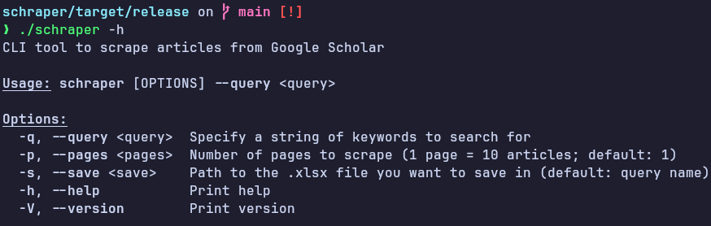

# Schraper
A Google Scholar article Scraper

## Usage
```
$ git clone --depth 1 https://github.com/Prana-vvb/schraper.git
$ cd schraper && cargo build --release
```

Run the binary in `target/release`




